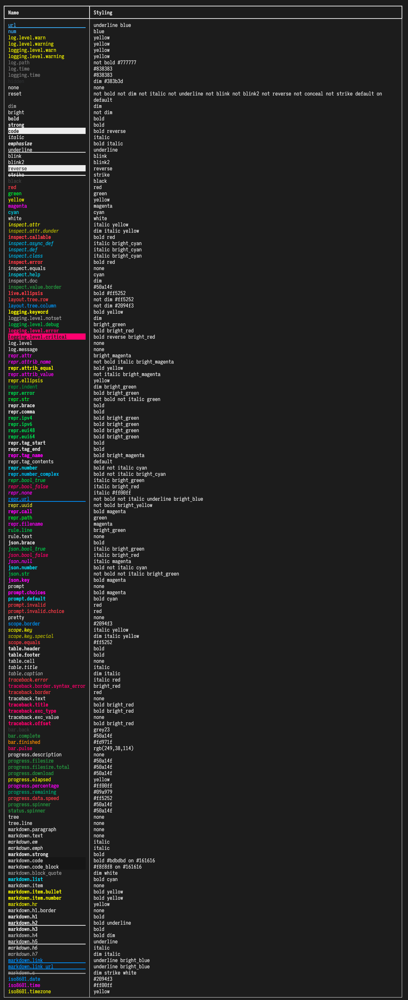
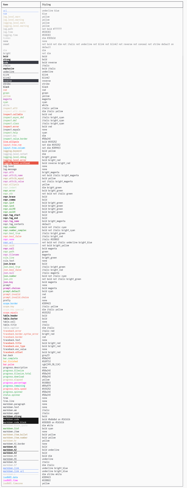

# `enrich` 💸
Sam Foreman
2024-01-28

## `rich` 🤝 `logging`

`enrich` provides a generalized
[`RichHandler`](https://github.com/saforem2/enrich/blob/main/src/enrich/handler.py#L28)
that allows for [`rich`](https://github.com/Textualize/rich) style
highlights **without line breaks**

<!--<div id="fig-compare" layout-valign="bottom"
style="display: flex; align-items: flex-end;">

<table style="width:100%;">
<colgroup>
<col style="width: 40%" />
<col style="width: 10%" />
<col style="width: 40%" />
</colgroup>
<tbody>
<tr class="odd">
<td style="text-align: center;"><div width="40%"
data-layout-align="center">
<p></p>
</div></td>
<td style="text-align: center;"><div class="quarto-figure-spacer"
width="10%" data-layout-align="center">
<p> </p>
</div></td>
<td style="text-align: center;"><div width="40%"
data-layout-align="center">
<p></p>
</div></td>
</tr>
</tbody>
</table>

Figure 1: Imagine `nanoGPT`, with *all* the add-ons.

</div>
-->


<!-- ::: {layout="[[35, -5, 35]]" layout-valign="bottom" style="display: flex; text-align:center; align-items: flex-end;"} -->

<!--<div class="columns" style="display:flex;">

<div class="column" width="35%">


</div>

<div class="column" width="35%">


</div>

</div>
-->


<div style="text-align:center;" align="center">
  
 $\hspace{50pt}$ 

</div>

> [!TIP]
>
> This document is best viewed online at
> [`enrich`](https://saforem2.github.io/enrich)

## 🧩 Install

``` bash
python3 -m pip install "git+https://github.com/saforem2/enrich"
```

<details closed>
<summary>
<code>test_logger.py</code>
</summary>

``` python
from enrich import get_logger
log = get_logger(name='test', level='DEBUG')
log.debug('debug')
log.info('info')
log.warning('warning')
log.error('error')
log.critical('critical')
```

<details closed>
<summary>
<code>Output</code>:
</summary>

<div class="cell-output cell-output-display"
style="font-family:monospace!important;">

<pre style="white-space:pre;overflow-x:auto;line-height:normal;font-family:monospace;">
<span style="color:var(--ansi-black);">[</span><span style="color:var(--ansi-black-bright);">2024-01-28 </span><span style="color:var(--ansi-black-bright);">11:13:30</span><span style="color:var(--ansi-black);">]</span><span style="color:var(--ansi-black);">[</span><b><span style="color:var(--ansi-green);">DEBUG</span></b><span style="color:var(--ansi-black);">]</span><span style="color:var(--ansi-black);">[</span><i><span style="color:var(--ansi-cyan);">test_logger</span></i><span style="color:var(--ansi-green-bright)">:</span><span style="color:var(--ansi-black);">24</span><span style="color:var(--ansi-black);">]</span><b><span style="color:var(--ansi-yellow-bright);"> - </span></b>debug  
<span style="color:var(--ansi-black);">[</span><span style="color:var(--ansi-black-bright);">2024-01-28 </span><span style="color:var(--ansi-black-bright);">11:13:30</span><span style="color:var(--ansi-black);">]</span><span style="color:var(--ansi-black);">[</span><b><span style="color:var(--ansi-blue);">INFO</span></b><span style="color:var(--ansi-black);">]</span><span style="color:var(--ansi-black);">[</span><i><span style="color:var(--ansi-cyan);">test_logger</span></i><span style="color:var(--ansi-green-bright)">:</span><span style="color:var(--ansi-black);">25</span><span style="color:var(--ansi-black);">]</span><b><span style="color:var(--ansi-yellow-bright);"> - </span></b>info  
<span style="color:var(--ansi-black);">[</span><span style="color:var(--ansi-black-bright);">2024-01-28 </span><span style="color:var(--ansi-black-bright);">11:13:30</span><span style="color:var(--ansi-black);">]</span><span style="color:var(--ansi-black);">[</span><span style="color:var(--ansi-yellow);">WARNING</span><span style="color:var(--ansi-black);">]</span><span style="color:var(--ansi-black);">[</span><i><span style="color:var(--ansi-cyan);">test_logger</span></i><span style="color:var(--ansi-green-bright)">:</span><span style="color:var(--ansi-black);">26</span><span style="color:var(--ansi-black);">]</span><b><span style="color:var(--ansi-yellow-bright);"> - </span></b>warning  
<span style="color:var(--ansi-black);">[</span><span style="color:var(--ansi-black-bright);">2024-01-28 </span><span style="color:var(--ansi-black-bright);">11:13:30</span><span style="color:var(--ansi-black);">]</span><span style="color:var(--ansi-black);">[</span><b><span style="color:var(--ansi-red);">ERROR</span></b><span style="color:var(--ansi-black);">]</span><span style="color:var(--ansi-black);">[</span><i><span style="color:var(--ansi-cyan);">test_logger</span></i><span style="color:var(--ansi-green-bright)">:</span><span style="color:var(--ansi-black);">27</span><span style="color:var(--ansi-black);">]</span><b><span style="color:var(--ansi-yellow-bright);"> - </span></b>error  
<span style="color:var(--ansi-black);">[</span><span style="color:var(--ansi-black-bright)">2024-01-28 </span><span style="color:var(--ansi-black-bright)">11:13:30</span><span style="color:var(--ansi-black);">]</span><span style="color:var(--ansi-black);">[</span><b><span style="color:var(--black000); background-color: var(--ansi-red-bright);">CRITICAL</span></b><span style="color:var(--ansi-black);">]</span><span style="color:var(--ansi-black);">[</span><i><span style="color:var(--ansi-cyan);">test_logger</span></i><span style="color:var(--ansi-green-bright)">:</span><span style="color:var(--ansi-black);">28</span><span style="color:var(--ansi-black);">]</span><b><span style="color:var(--ansi-yellow-bright);"> - </span></b>critical
</pre>

</div>

</details>
</details>

## 📸 Screenshots

<details>
<summary>
<b>🤷🏻‍♂️ Ambivalent</b>
</summary>


</details>
<details>
<summary>
<b>😻 Catpuccin Latte</b>
</summary>

 

</details>
<details>
<summary>
<b>😈 Doom One</b>
</summary>

 

</details>

## 💅 Styles

<details closed>
<summary>
Dark Styles
</summary>

</details>
<details closed>
<summary>
Light Styles
</summary>

</details>
</details>
<!-- <details closed><summary>Screenshot:</summary> -->
<!---->
<!-- ::: {#fig-test-logger} -->
<!---->
<!-- {.stretch} -->
<!---->
<!-- ::: -->
<!---->
<!-- </details> -->

## ⚙️ Setup

``` python
from enrich import get_logger
log = get_logger(name='enrich', level='DEBUG')
```

<details>
<summary>
<code>Output</code>
</summary>

``` python
log.debug('debug')
log.info('info')
log.warning('warning')
log.error('error')
log.critical('critical')
[2024-01-28 11:04:50][DEBUG][ipython:1] - debug
[2024-01-28 11:04:50][INFO][ipython:2] - info
[2024-01-28 11:04:50][WARNING][ipython:3] - warning
[2024-01-28 11:04:50][ERROR][ipython:4] - error
[2024-01-28 11:04:50][CRITICAL][ipython:5] - critical
```

</details>
<details>
<summary>
Alternative Setup
</summary>

- `logging.config.dictConfig(...)`:

  ``` python
  import yaml
  with Path('logconf.yaml').open('r') as stream:
      config = yaml.load(stream, Loader=yaml.FullLoader)
  log_config = logging.config.dictConfig(config)
  log = logging.getLogger(__name__)
  log.setLevel('INFO')
  ```

- Where `logconf.yaml`:

  ``` yaml
  ---
  # logconf.yaml
  handlers:
    term:
      class: enrich.handler.RichHandler
      show_time: true
      show_level: true
      enable_link_path: false
      level: DEBUG
  root:
    handlers: [term]
  disable_existing_loggers: false
  ...
  ```

</details>

## 📚 Details

### ↪️ Redirect support

Our Console class adds one additional option to rich.Console in order to
redirect `sys.stdout` and `sys.stderr` streams using a FileProxy.

``` python
from enrich.console import Console
import sys

console = Console(
    redirect=True,  # <-- not supported by rich.console.Console
    record=True)
sys.write("foo")

# this assert would have passed without redirect=True
assert console.export_text() == "foo"
```

### 🌯 Soft wrapping

If you want to produce fluid terminal output, one where the client
terminal decides where to wrap the text instead of the application, you
can now tell the Console constructor the soft_wrap preference.

``` python
from enrich.console import Console
import sys

console = Console(soft_wrap=True)
console.print(...)  # no longer need to pass soft_wrap to each print
```

Rich logger assumes that you always have a fixed width console and it
does wrap logged output according to it. Our alternative logger does
exactly the opposite: it ignores the columns of the current console and
prints output using a Console with soft wrapping enabled.

The result are logged lines that can be displayed on any terminal or web
page as they will allow the client to decide when to perform the
wrapping.

``` python
import logging
from enrich.logging import RichHandler

FORMAT = "%(message)s"
logging.basicConfig(
    level="NOTSET", format=FORMAT, datefmt="[%X]", handlers=[RichHandler()]
)

log = logging.getLogger("rich")
log.info("Text that we do not want pre-wrapped by logger: %s", 100 * "x")
```

### 💾 ANSI Escapes

Extends Rich Console to detect if original text already had ANSI escapes
and decodes it before processing it. This solves the case where printing
output captured from other processes that contained ANSI escapes would
brake.
[upstream-404](https://github.com/willmcgugan/rich/discussions/404)

</details>

------------------------------------------------------------------------

> [!IMPORTANT]
>
> ### <span style="color: var(--ansi-red);">❤️‍🩹 Status</span>
>
> <pre style="white-space:pre;overflow-x:auto;line-height:normal;font-family:Menlo,'DejaVu Sans Mono',consolas,'Courier New',monospace"><span style="color: #7f7f7f; text-decoration-color: #7f7f7f; font-style: italic">Last Updated</span>: <span style="color: #f06292; text-decoration-color: #f06292; font-weight: bold">01</span><span style="color: #f06292; text-decoration-color: #f06292">/</span><span style="color: #f06292; text-decoration-color: #f06292; font-weight: bold">28</span><span style="color: #f06292; text-decoration-color: #f06292">/</span><span style="color: #f06292; text-decoration-color: #f06292; font-weight: bold">2024</span> <span style="color: #7f7f7f; text-decoration-color: #7f7f7f">@</span> <span style="color: #1a8fff; text-decoration-color: #1a8fff; font-weight: bold">12:19:09</span>
> </pre>
> <!-- [[](https://hits.seeyoufarm.com)]{style="text-align:center;"} -->
> <p align="center">
> <a href="https://hits.seeyoufarm.com"></a>
> </p>
